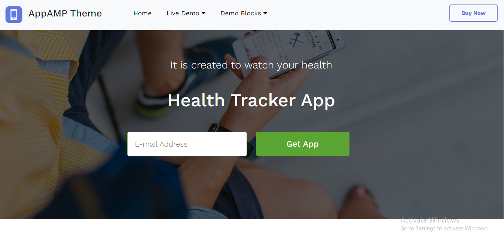

# HEALTH TRACKER APP

<h3> 📝📝 DESCRIPTION</h3>
  

It's an advance website .The website is fully responsive .You can check it with any kind of device.I used a lot of hover effect in the website.This website's design is almost similar with second web.but it has more features with responsive design.🙆‍♂️🙆‍♂️

<h3>🛠🛠 TOOLS</h3>
<ul>
  <li><h5>HTML5</h5></li>
  <li><h5>CSS3</h5></li>
  <li><h5>BOOTSTRAP</h5></li>
</ul>
  
### 🎨PREVIEW 

 <h3>🔗🔗LIVE PREVIEW LINK:</h3>
  [Third Web](https://sohaghossainpappu.github.io/third_web/)
